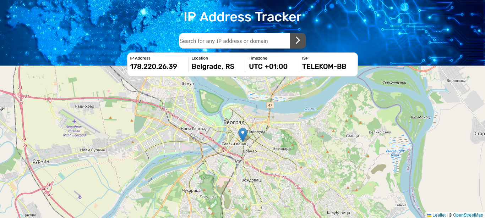
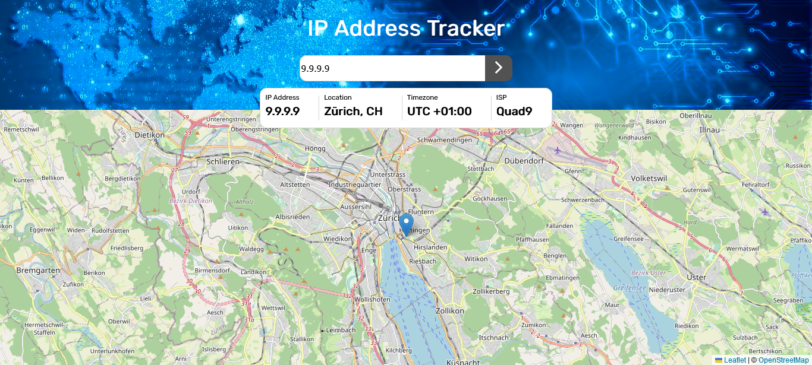

# IP Address Tracker

#### Description:

This is a small web application that shows user's ip address, location, timezone, and internet service provider. It also displays a map centered on the user's location.

## Table of contents

- [Overview](#overview)
- [Project structure](#project-structure)
- [Built with](#built-with)
- [What I learned](#what-i-learned)

## Overview

This web aplication was made using HTML, CSS, and JavaScript.
To get the IP Address locations, I used the [IP Geolocation API by IPify](https://geo.ipify.org/). To generate the map, I used [LeafletJS](https://leafletjs.com/).

Users are able to:

- View the optimal layout for each page depending on their device's screen size
- See hover states for all interactive elements on the page
- See their own IP address on the map on the initial page load
- Search for any IP addresses or domains and see the key information and location

### Built with

- HTML5 markup
- CSS custom properties
- Flexbox
- JavaSript
- [IP Geolocation API by IPify](https://geo.ipify.org/)
- [LeafletJS](https://leafletjs.com/)
